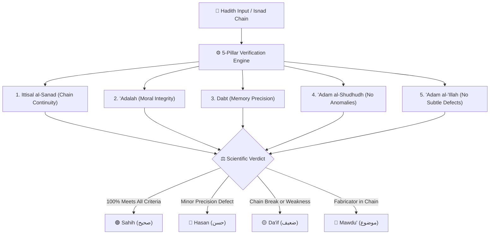

<div align="center">

# 📖 Hadith Verification Engine
### تحقيق الأحاديث النبوية الشريفة وفق أصول الحديث وعلم الرجال
**A Rule-Based Islamic Hadith Verification System & Chain Continuity Auditor**

[](https://python.org)
[](https://fastapi.tiangolo.com)
[](https://github.com)
[](LICENSE)
[](https://github.com)

[🌟 Live Demo](#-how-to-run) • [✨ Key Features](#-key-features) • [📜 5-Pillar Methodology](#-the-5-pillars-of-hadith-verification) • [📥 API & Scraper](#-live-hadith-fetcher--scraper) • [🚀 Quick Start](#-quick-start-guide)

</div>

---

## 🌟 Overview

The **Hadith Verification Engine (المُحقِّق - Tahqiq al-Hadith)** is an open-source, deterministic verification platform built upon classical Islamic Hadith methodology (*Mustalah al-Hadith*, *Usul al-Hadith*, and *Ilm ar-Rijal*). 

Formalized by classical scholars including **Ibn al-Salah, Al-Nawawi, Ibn Hajar al-Asqalani, and Al-Dhahabi**, this engine evaluates the authentic chain of transmission (*Isnad*) and the prophetic text (*Matn*) across the **5 classical conditions of Sahih Hadith**.



---

## ✨ Key Features

- **⚡ Smart Verifier**: Instant automated verification with animated purity score badges (*Sahih*, *Hasan*, *Da'if*, *Mawdu'*).
- **⛓️ Interactive Sanad Chain Builder**: Dynamically add or remove transmitters, adjust transmission formulas (*Haddathana*, *'An*, *Sami'tu*, *Akhbarana*), and observe real-time grade transitions.
- **📜 Visual Sanad Graph Diagram**: Graph representation of narrators color-coded by reliability rank:
  - 🟢 **Emerald**: *Thiqah Thabt* (Trustworthy Master)
  - 🔵 **Blue**: *Saduq* (Truthful / Good Memory)
  - 🟡 **Amber**: *Da'if / Mudallis* (Weak / Subject to Scrutiny)
  - 🔴 **Red**: *Matruk / Kadhdhab* (Abandoned / Fabricator)
- **👤 Ilm ar-Rijal Biographical Inspector**: Built-in biographical encyclopedia detailing generation (*Tabaqah*), death dates in Hijri, teachers, and quotes from *Jarh wa Ta'dil* masters.
- **📥 IslamicUrduBooks.com & Canonical CDN Fetcher**: Multi-source fetcher with zero latency fallback providing Arabic Matn, Urdu translations, English translations, and narrator metadata across the Six Canonical Books (*Kutub al-Sittah*), *Muwatta Malik*, and *40 Nawawi*.
- **⚖️ Guided Step-by-Step Auditor**: An interactive question-driven wizard teaching students how to grade any narration.
- **🌐 Trilingual Localization**: Full support for **English**, **العربية (Arabic)**, and **اردو (Urdu)** with bidirectional LTR/RTL layout switching.
- **🌓 Glassmorphic UI & Dark/Light Mode**: Aesthetic Islamic green and gold design built for readability and focus.
- **🖨️ Tahqiq Report Export**: Generate and print standardized scholarly verification sheets.

---

## 📜 The 5 Pillars of Hadith Verification

| Condition | Arabic | Meaning & Implementation |
| :--- | :--- | :--- |
| **1. Ittisal al-Sanad** | **اتصال السند** | **Chain Continuity**: Every narrator must have received the Hadith directly from their teacher without missing intermediaries. Detects *Mu'allaq*, *Mursal*, *Mu'dal*, *Munqati'*, and *Tadlis*. |
| **2. 'Adalat ar-Ruwat** | **عدالة الرواة** | **Moral Integrity**: Every transmitter must be a practicing Muslim of sound mind, morally upright, free from *Fisq*, and truthful. (*Companions are upright by divine consensus*). |
| **3. Dabt ar-Ruwat** | **ضبط الرواة** | **Precision & Accuracy**: The narrator must possess retentive memory (*Dabt al-Sadr*) or accurate manuscripts (*Dabt al-Kitab*) free from frequent delusions (*Awham*). |
| **4. 'Adam al-Shudhudh** | **السلامة من الشذوذ** | **Absence of Irregularity**: The narration must not contradict reports transmitted by narrators who are more trustworthy or greater in number. |
| **5. 'Adam al-'Illah** | **السلامة من العلة** | **Absence of Hidden Flaws**: The Hadith must be free of obscure defects (*Idraj*, *Irsal Khafi*, *Qalb*) that compromise its authenticity. |

---

## 🚀 Quick Start Guide

### Prerequisites
- Python 3.10+ (optional if using standalone mode)

### 1. Clone the Repository
```bash
git clone https://github.com/YOUR_USERNAME/hadith-verification-engine.git
cd hadith-verification-engine
```

### 2. Run with One Click (Windows)
Double-click `run_server.bat` or run:
```powershell
.\run_server.ps1
```

### 3. Run with Python / Uvicorn (Linux, macOS, Windows)
```bash
# Install dependencies
pip install -r requirements.txt

# Start FastAPI application
python -m uvicorn backend.main:app --host 127.0.0.1 --port 8000 --reload
```
Open **[http://127.0.0.1:8000](http://127.0.0.1:8000)** in your browser.

### 4. Standalone Offline Mode (Zero Server Dependency)
Simply double-click `frontend/index.html` in your file explorer. The frontend includes a mirror of the rule engine for offline evaluation.

---

## 📥 Live Hadith Fetcher & Scraper

### Supported Canonical Collections
- **صحيح البخاري** (Sahih al-Bukhari) - 7,563 Hadiths
- **صحيح مسلم** (Sahih Muslim) - 7,563 Hadiths
- **سنن أبي داود** (Sunan Abi Dawud) - 5,274 Hadiths
- **جامع الترمذي** (Jami' at-Tirmidhi) - 3,956 Hadiths
- **سنن النسائي** (Sunan an-Nasa'i) - 5,758 Hadiths
- **سنن ابن ماجه** (Sunan Ibn Majah) - 4,341 Hadiths
- **موطأ الإمام مالك** (Muwatta Malik) - 1,858 Hadiths
- **الأربعون النووية** (40 Hadith of Imam al-Nawawi) - 42 Hadiths

### CLI Batch Scraper
```bash
# Scrape Hadiths 1 to 10 from Sahih Bukhari
python scraper_islamicurdubooks.py --book 1 --start 1 --end 10 --output bukhari_sample.json

# Scrape Hadiths 1 to 5 from Sahih Muslim
python scraper_islamicurdubooks.py --book 2 --start 1 --end 5 --output muslim_sample.json
```

### REST API Endpoints
- `GET /api/hadiths` - Search verified corpus with filters.
- `GET /api/narrators` - Search biographical Rijal database.
- `POST /api/verify` - Run full 5-pillar verification on custom narrator chains.
- `GET /api/islamicurdubooks/fetch?book_id=1&hadith_number=1` - Fetch text & translations.
- `POST /api/islamicurdubooks/import-and-verify` - 1-click fetch & verify.

Interactive API documentation is accessible at: **[http://127.0.0.1:8000/docs](http://127.0.0.1:8000/docs)**.

---

## 📁 Project Structure

```
hadith-verification-engine/
├── backend/
│   ├── main.py                     # FastAPI REST API & static file server
│   ├── models.py                   # Pydantic data schemas
│   ├── rules_engine.py             # 5-rule verification engine
│   ├── islamic_urdu_books.py       # High-speed scraper & multi-source CDN service
│   ├── rijal_database.py           # Ilm ar-Rijal biographical database
│   └── corpus_database.py          # Pre-authenticated canonical Hadith corpus
├── frontend/
│   ├── index.html                  # Trilingual web application interface
│   ├── css/
│   │   ├── styles.css              # Glassmorphic emerald & gold design system
│   │   └── rtl.css                 # Bidirectional Arabic and Urdu stylesheet
│   └── js/
│       ├── app.js                  # Master application controller
│       ├── i18n.js                 # Trilingual localization (EN, AR, UR)
│       ├── rule_engine.js          # Client-side verification mirror
│       ├── sanad_graph.js          # Interactive Sanad chain visualizer
│       └── auditor.js              # Guided audit workflow
├── scraper_islamicurdubooks.py      # Standalone CLI batch scraper
├── requirements.txt                # Python dependencies
├── run_server.bat                  # One-click Windows batch launcher
├── run_server.ps1                  # Windows PowerShell launcher
└── README.md
```

---

## 📚 Classical References & Bibliography

1. **Ibn al-Salah**: *Muqaddimat Ibn al-Salah fi 'Ulum al-Hadith* (مقدمة ابن الصلاح)
2. **Ibn Hajar al-Asqalani**: *Nukhbat al-Fikar fi Mustalah Ahl al-Athar* & *Tahdhib al-Tahdhib* (نخبة الفكر)
3. **Al-Dhahabi**: *Al-Muqizah fi 'Ilm Mustalah al-Hadith* & *Mizan al-I'tidal* (الموقظة)
4. **Al-Nawawi**: *Taqrib al-Nawawi* & *Al-Minhaj Sharh Sahih Muslim* (التقريب والتيسير)

---

## 👨‍💻 Designer & Developer

<div align="center">

### Designed & Developed by **Muhammad Hamza**
*Full-Stack Developer & UI/UX Designer*

[](https://github.com/MuhammadHamza1819)
[](https://linkedin.com)
[](https://github.com/MuhammadHamza1819)

</div>

---

## 🤝 Contributing

Contributions, feature suggestions, and pull requests are warmly welcomed! Please open an issue or submit a PR to help expand the Rijal biographical database or refine verification rules.

---

## 📄 License

Distributed under the **MIT License**. Copyright © 2026 **Muhammad Hamza**. See `LICENSE` for more information.
